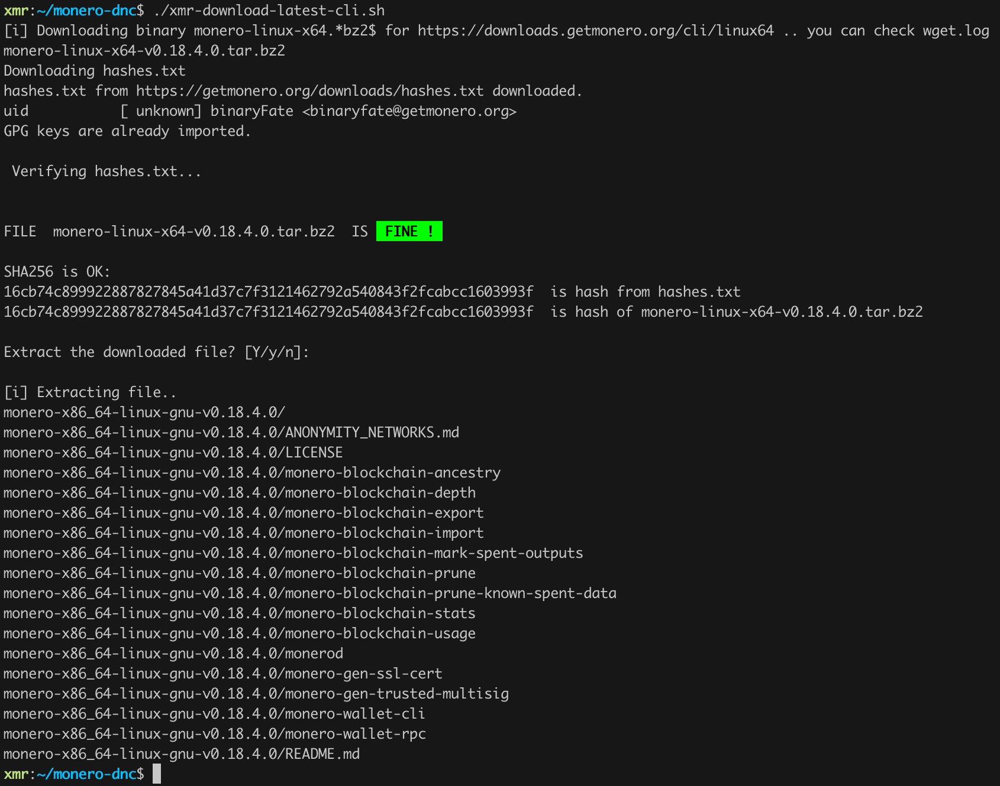

# Monero DOWNLOAD aNd CHECK

Simle shell scripts to download and check (VERIFY) new monero binaries..

# Usage 
`./xmr-download-latest-cli.sh`

Will DOWNLOAD and VERIFY latest version of monero cli for you platform.

# Verify only
If you have binaries already downloaded you can verify them with:

`./xmr-check-download.sh <filename.tar.bz2>`
